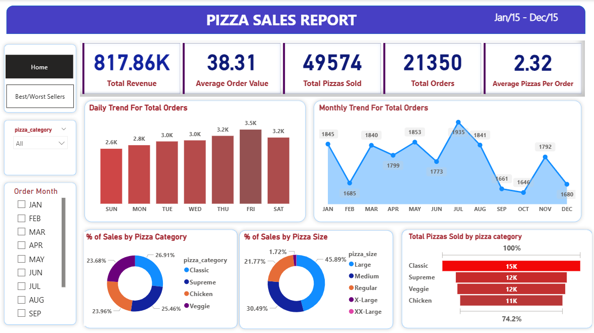
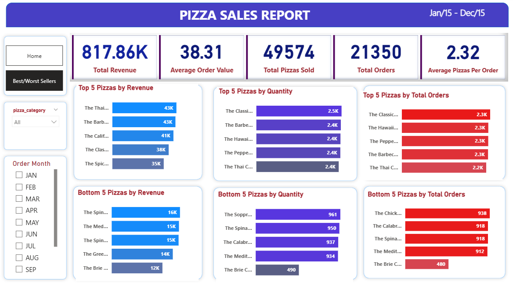

# 🍕 Pizza Sales Performance Analytics (SQL & Power BI)

## 📌 Project Overview
This project is an end-to-end Data Analytics solution designed to analyze the sales performance of a Pizza franchise. By leveraging **PostgreSQL** for data processing and **Power BI** for data visualization, this project transforms raw sales data into actionable business insights. The goal is to optimize revenue, understand customer purchasing behavior, and identify top/worst-performing products.

## 🛠️ Tech Stack Used
* **Database Management:** PostgreSQL (Complex Queries, CAST functions, Date/Time functions, Aggregations)
* **Data Visualization:** Power BI Desktop (DAX, Custom Charts, New Card Visuals, Action Filters, Page Navigation)
* **Data Source:** Raw CSV Data

## 🚀 Key Business Insights
* **Peak Ordering Times:** Order volumes are highest on **Thursdays and Fridays**, indicating a strong end-of-week demand spike.
* **Seasonal Trend:** **July and January** recorded the maximum number of orders, suggesting peak seasonal engagement.
* **Top Revenue Generator:** **The Thai Chicken Pizza** contributes the most to the total revenue, despite not being the highest in quantity sold.
* **Category Dominance:** The **Classic category** is the most popular, contributing maximally to total sales and overall order volume.
* **Preferred Size:** **Large-sized pizzas** account for the highest percentage of sales (45.89%), making it the most preferred choice among customers.
* **Underperforming Product:** **The Brie Carre Pizza** is the worst-performing product across all metrics (Revenue, Quantity, and Total Orders), indicating a need for menu optimization or promotional strategies.

## 📊 Dashboard Snapshots

### 1. Sales Overview Dashboard
*(This dashboard provides a high-level overview of revenue, order values, and sales trends).*

### 2. Product Performance Analysis
*(This dashboard highlights the Top 5 Best Sellers and Bottom 5 Worst Sellers based on Revenue, Total Quantity, and Total Orders).*

## 💻 SQL Queries Highlight
All the KPIs and trends were initially queried and validated using PostgreSQL before visualizing them in Power BI. 
* Check out the `Pizza_Sales_Queries.sql` file in this repository to see the raw SQL queries used for data extraction and two-way validation.

---
*If you find this project helpful, feel free to give it a ⭐ on GitHub!*
